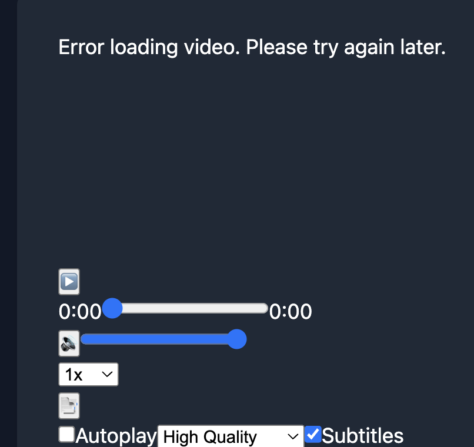
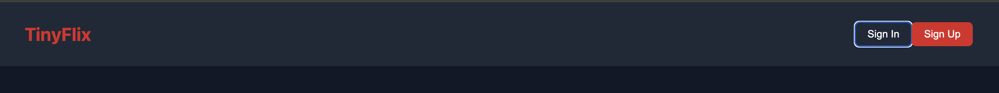
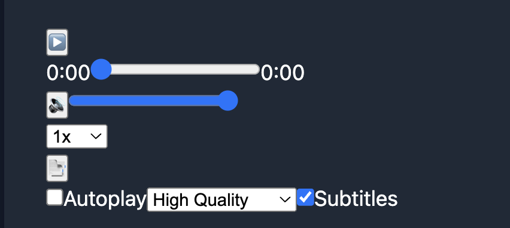
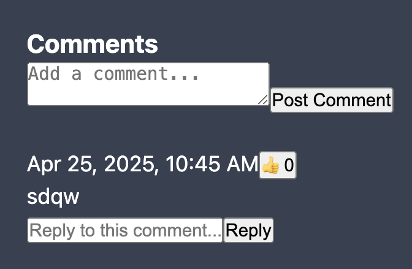
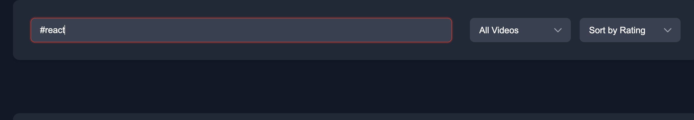
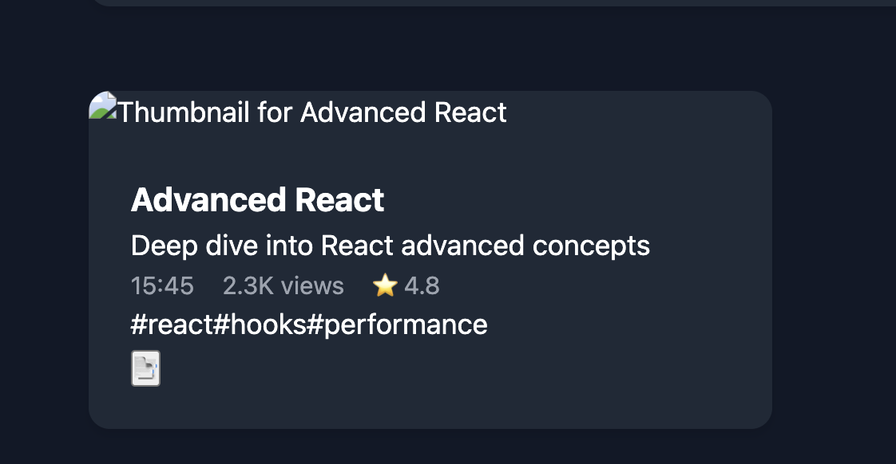
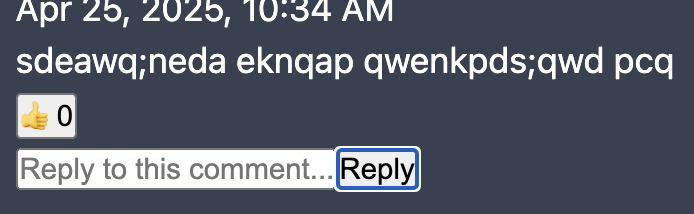

# TinyFlix Bug Report

## Bug Prioritization

### Critical Bugs
1. [Bug #1] - Video player bookmark navigation not functional
2. [Bug #2] - Error handling in video playback lacks recovery options
3. [Bug #3] - Sign In and Sign Up buttons are not working as expected

### Major Priority Bugs
1. [Bug #4] - Incorrect duration formatting in VideoCard component
2. [Bug #5] - Reply functionality doesn't update UI correctly
3. [Bug #6] - Single person can like unlimited for a comment

### Medium Priority Bugs
1. [Bug #7] - Accessibility issues with volume control slider
2. [Bug #8] - Filter logic for "popular" videos is hardcoded
3. [Bug #9] - Missing validation for reply form input

### Low Priority Bugs
1. [Bug #10] - Loading spinner lacks proper animation styling
2. [Bug #11] - Inconsistent error message styling

## Bug Report #1

### Title
Video player bookmark navigation not functional

### Severity
- [x] Critical
- [ ] High
- [ ] Medium
- [ ] Low

### Component
BookmarkList component

### Environment
- Browser: All browsers
- OS: All operating systems
- Screen Size: All screen sizes
- Device: All devices

### Steps to Reproduce
1. Open the application
2. Select a video to play
3. Add a bookmark while watching
4. Click on the bookmark in the bookmark list

### Expected Behavior
The video should jump to the timestamp associated with the bookmark.

### Actual Behavior
Clicking on a bookmark only logs a message to the console and doesn't actually navigate to the timestamp in the video.

### Screenshots/Videos


### Additional Context
In BookmarkList.jsx, the `handleBookmarkClick` function only logs to 
There's no actual implementation to navigate to the timestamp in the video.

### Suggested Fix
Implement proper bookmark navigation by passing a callback function from the parent component:

## Bug Report #2

### Title
Error handling in video playback lacks recovery options

### Severity
- [x] Critical
- [ ] High
- [ ] Medium
- [ ] Low

### Component
VideoPlayer component

### Environment
- Browser: All browsers
- OS: All operating systems
- Screen Size: All screen sizes
- Device: All devices

### Steps to Reproduce
1. Open the application
2. Select a video to play
3. Encounter a video loading error

### Expected Behavior
The application should display an error message with options to retry loading the video or report the issue.

### Actual Behavior
The application only displays an error message without providing any recovery options.

### Screenshots/Videos



### Suggested Fix
Add recovery options to the error message

## Bug Report #3
### Title
 Sign In and Sign Up buttons are not working as expected
### Severity
- [x] Critical
- [ ] High
- [ ] Medium
- [ ] Low
### Component
Header
### Environment
- Browser: All browsers
- OS: All operating systems
- Screen Size: All screen sizes
- Device: All devices
### Steps to Reproduce
1. Open the application
2. click sign in or sign up
### Expected Behavior
User should able to signIn or Sign up Accordingly
### Actual Behavior
The functionlity is not happening
### Screenshots/Videos


## Bug Report #4

### Title
Incorrect duration formatting in VideoCard component

### Severity
- [ ] Critical
- [x] High
- [ ] Medium
- [ ] Low

### Component
VideoCard component

### Environment
- Browser: All browsers
- OS: All operating systems
- Screen Size: All screen sizes
- Device: All devices

### Steps to Reproduce
1. Open the application
2. View the list of videos with their durations

### Expected Behavior
Video durations should be properly formatted (e.g., "10:30" should be displayed as "10:30").

### Actual Behavior
The `formatDuration` function in VideoCard.jsx simply returns the duration without any formatting:

### Screenshots/Videos


### Additional Context
This is inconsistent with the formatting in other components like VideoPlayer.jsx, which properly formats time values.

### Suggested Fix
Implement proper duration formatting

## Bug Report #5

### Title
Reply functionality doesn't update UI correctly

### Severity
- [ ] Critical
- [x] High
- [ ] Medium
- [ ] Low

### Component
CommentBox component

### Environment
- Browser: All browsers
- OS: All operating systems
- Screen Size: All screen sizes
- Device: All devices

### Steps to Reproduce
1. Open the application
2. Select a video
3. Add a comment
4. Reply to the comment
5. Like the reply

### Expected Behavior
The like count for the reply should increase when clicked.

### Actual Behavior
The like button for replies doesn't work correctly because the `handleLike` function only updates top-level comments, not replies.

### Screenshots/Videos


### Additional Context
In CommentBox.jsx, the `handleLike` function only updates top-level comments:
When this function is called for a reply, it looks for a top-level comment with the reply's ID, which doesn't exist.

### Suggested Fix
Modify the `handleLike` function to handle both comments and replies

## Bug Report #6

### Title
Single person can like unlimited for a comment

### Severity
- [ ] Critical
- [x] High
- [ ] Medium
- [ ] Low

### Component
Comments

### Environment
- Browser: All browsers
- OS: All operating systems
- Screen Size: All screen sizes
- Device: All devices

### Steps to Reproduce
1. Open the application
2. Post a comment for a video
3. like as much you can

### Expected Behavior
For one person one like should be allowed

### Actual Behavior
a single person can like unlimited 

### Screenshots/Videos


### Suggested Fix
Handle the like button like single person can like one time for a comment 


## Bug Report #7

### Title
Unable to search via Tags

### Severity
- [ ] Critical
- [ ] High
- [x] Medium
- [ ] Low

### Component
VideoPlayer component

### Environment
- Browser: All browsers
- OS: All operating systems
- Screen Size: All screen sizes
- Device: All devices

### Steps to Reproduce
1. Open the application
2. Search any video by below displayed tags
3. no results found

### Expected Behavior
The respected video related to the tags should be displayed

### Actual Behavior
No videos displayed

### Screenshots/Videos



### Suggested Fix
enable search component to search via tags
## Bug Report #8

### Title
Filter logic for "popular" videos is hardcoded

### Severity
- [ ] Critical
- [ ] High
- [x] Medium
- [ ] Low

### Component
App component

### Environment
- Browser: All browsers
- OS: All operating systems
- Screen Size: All screen sizes
- Device: All devices

### Steps to Reproduce
1. Open the application
2. Select "Popular" from the filter dropdown

### Expected Behavior
The definition of "popular" should be configurable or based on relative metrics rather than an absolute hardcoded value.

### Actual Behavior
In App.jsx, the filter for "popular" videos is hardcoded to a specific view count:
```javascript
if (filter === 'popular') {
  return matchesSearch && v.viewCount > 2000;
}
```

### Screenshots/Videos


### Additional Context
This hardcoded approach doesn't scale well as the application grows. If most videos eventually exceed 2000 views, the filter becomes meaningless.

### Suggested Fix
Implement a relative popularity metric

## Bug Report #10

### Title
Missing validation for reply form input

### Severity
- [ ] Critical
- [ ] High
- [x] Medium
- [ ] Low

### Component
CommentBox component

### Environment
- Browser: All browsers
- OS: All operating systems
- Screen Size: All screen sizes
- Device: All devices

### Steps to Reproduce
1. Open the application
2. Select a video
3. Add a comment
4. Submit an very long reply

### Expected Behavior
The reply form should validate input similar to the main comment form,  limiting length.

### Actual Behavior
The reply form only checks if the input is empty using `trim()` but doesn't enforce any other validation rules


### Screenshots/Videos



### Suggested Fix
Apply some validation to replies:

## Bug Report #10

### Title
Loading spinner lacks proper animation styling

### Severity
- [ ] Critical
- [ ] High
- [ ] Medium
- [x] Low

### Component
LoadingSpinner component

### Environment
- Browser: All browsers
- OS: All operating systems
- Screen Size: All screen sizes
- Device: All devices

### Steps to Reproduce
1. Open the application
2. Perform an action that triggers loading state

### Expected Behavior
The loading spinner should have proper CSS animation defined to visually indicate loading.

### Actual Behavior
The LoadingSpinner component references a `.spinner` class but doesn't define any animation properties:

### Screenshots/Videos


### Suggested Fix
Add appropriate CSS animation to the spinner:

## Bug Report #11

### Title
Inconsistent error message styling

### Severity
- [ ] Critical
- [ ] High
- [ ] Medium
- [x] Low

### Component
Multiple components (App, VideoPlayer, CommentBox)

### Environment
- Browser: All browsers
- OS: All operating systems
- Screen Size: All screen sizes
- Device: All devices

### Steps to Reproduce
1. Open the application
2. Trigger different error states across components

### Expected Behavior
Error messages should have consistent styling and structure across all components.

### Actual Behavior
Different components use different class names and structures for error messages:

### Screenshots/Videos


### Additional Context
Inconsistent error styling can confuse users and make the application feel disjointed.

### Suggested Fix
Standardize error message styling across all components:

## Summary of Findings

### Total Bugs Identified: 11

### Distribution by Severity
- Critical: 3
- High: 3
- Medium: 3
- Low: 2

### Distribution by Component
- Video Player: 2
- Search/Filter: 1
- Bookmarks: 2
- Comments: 3
- Accessibility: 1
- Header: 1
- Performance: 0
- Other: 1

## Recommendations

### Immediate Actions
1. Fix critical bugs related to video playback , bookmark ,Signin functionality
2. Implement proper error handling with recovery options
3. Add video source fallbacks to improve reliability

### Long-term Improvements
1. Standardize UI components for consistent user experience
2. Enhance accessibility features across all components
3. Implement comprehensive validation for all user inputs
